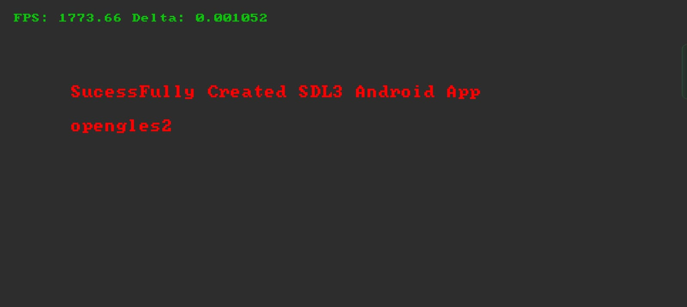

# zig-sdl3-android-test



### Build, install to test one target against a local emulator and run

```sh
zig build -Dtarget=x86_64-linux-android
adb install ./zig-out/bin/sdl-android-test.apk
adb shell am start -S -W -n com.zig.sdl3/com.zig.sdl3.ZigSDLActivity
```

### Build and install for all supported Android targets

```sh
zig build -Dandroid=true
adb install ./zig-out/bin/sdl-zig-demo.apk
```

### Uninstall your application

If installing your application fails with something like:
```
adb: failed to install ./zig-out/bin/sdl3.apk: Failure [INSTALL_FAILED_UPDATE_INCOMPATIBLE: Existing package com.zig.sdl3 signatures do not match newer version; ignoring!]
```

```sh
adb uninstall "com.zig.sdl3"
```

### View logs of application

Powershell (app doesn't need to be running)
```sh
adb logcat | Select-String com.zig.sdl3:
```

Bash (app doesn't need running to be running)
```sh
adb logcat | grep com.zig.sdl3:
```

Bash (app must be running, logs everything by the process including modules)
```sh
adb logcat --pid=`adb shell pidof -s com.zig.sdl3`
```

### Thanks to

- https://github.com/silbinarywolf/zig-android-sdk 
